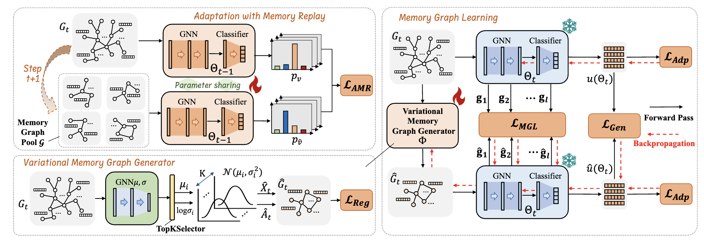

# GCAL

Code of Paper: "Towards Sustainable Reuse of Graph Models via Continual Adaptive Learning"

**Keywords**: Continual Learning, Domain adaptation, Graph neural network

## Abstract

This work addresses the challenge of unsupervised continual adaptation of graph models to evolving out-of-distribution (OOD) graph sequences. Traditional graph domain adaptation methods are limited to single-step adaptation, thus falling short of continual domain shifts and causing catastrophic forgetting. To address these challenges, this paper introduces the Graph Continual Adaptive Learning (GCAL) method, designed to enhance model sustainability and adaptability across various graph domains. GCAL employs a bilevel optimization strategy comprising "adapt" and "generate memory" phases. The "adapt" phase uses an information maximization approach to fine-tune the model with new domain graphs while re-adapting past memories to mitigate forgetting. Concurrently, the "generate memory" guided by a theoretical lower bound derived from information bottleneck theory, involves a variational memory graph generation module. This module is optimized through three specific losses: memory graph learning loss, regularization losses for stability and informativeness, and a generation loss to ensure relevance to the original graph. Extensive experimental evaluations demonstrate that GCAL substantially outperforms existing methods in terms of adaptability and knowledge retention, thereby offering a robust solution to the challenges of continual adaptation in graph models.



## **Dependency**
We used Python 3.9.19, PyTorch 2.2.1, PyTorch Geometric 2.5.3. For the Python packages, please see requirements.txt.

```
gensim==4.3.2
numpy == 1.26.3
pandas==2.1.4
pillow==10.2.0
scipy==1.11.4
torch==2.2.1
torch-cluster==1.6.3 
torch-scatter==2.1.2
torch-sparse==0.6.18 
torch-spline-conv==1.2.2 
torch_geometric==2.5.3 
```
## Download Datasets
We used the datasets provided by [Wu et al.](https://github.com/qitianwu/GraphOOD-EERM). We slightly modified their code to support data loading and put the code in the folder. 

You can make a directory `./data` and download all the datasets through the Google drive from [Wu et al.](https://github.com/qitianwu/GraphOOD-EERM):
```
https://drive.google.com/drive/folders/15YgnsfSV_vHYTXe7I4e_hhGMcx0gKrO8?usp=sharing
```
Make sure the data files are in the `./data` folder:
```
project
│   README.md
│   data_process.py
│   GCAL.py
|   main.py
|   ...
|
└───data
│       │   twitch
|       |   fb100
│       │   elliptic
│       │   ogbn-arxiv
```

The detailed data processing is in the `data_process.py`.

## Run the code
Simply run the following command to get started.
```
python main.py --device=0 --dataset=twitch --model=GCN  --seed=0 
python main.py --device=0 --dataset=ogbn-arxiv --model=GCN  --seed=0
python main.py --device=0 --dataset=elliptic --model=GCN  --seed=0 
python main.py --device=0 --dataset=fb100 --model=GCN  --seed=0 
python main.py --device=0 --dataset=ogbn-arxiv --model=SAGE  --seed=0 
python main.py --device=0 --dataset=twitch --model=GAT  --seed=0 
```

You can also run the following script.

```markdown
./GCAL.sh
```

Test-time graph transformation requires careful tuning skills. A general suggestion would be to choose small learning rate and small training epochs.
